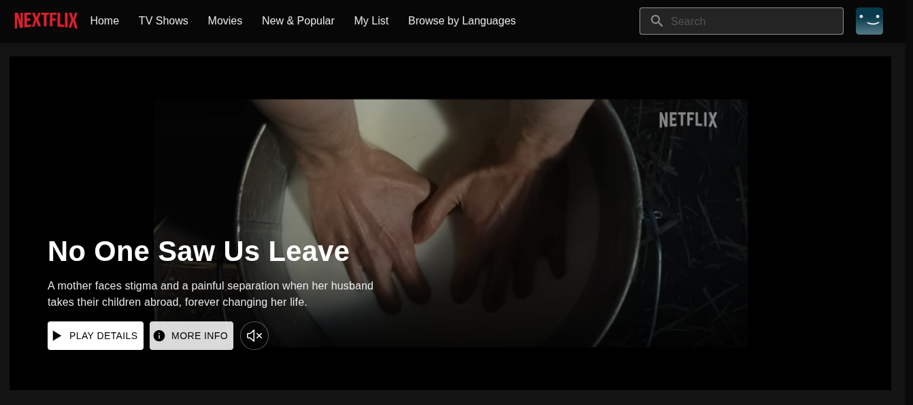

🎬 Netflix Clone (Next.js 15 + TypeScript + Tailwind)

A fully responsive Netflix-style web app built with Next.js 15, TypeScript, and Tailwind CSS, using The Movie Database (TMDB) API to fetch movies, TV shows, and trailers.

🚀 Features

🔍 Browse trending, top-rated, and upcoming movies

🎥 Watch trailers with a custom player page (/watch/[id])

🌙 Dark modern UI with Tailwind CSS

⚡ Powered by Next.js App Router and Server Components

🧩 Modular folder structure under src/app

📱 Fully responsive for desktop and mobile

🧠 TypeScript for type safety

🧰 Tech Stack
Category	Tools
Framework	Next.js 15

Language	TypeScript

Styling	Tailwind CSS

API	TMDB (The Movie Database)

⚙️ Getting Started

1️⃣ Clone the repository
git clone https://github.com/rufron/netflix-clone.git
cd netflix

2️⃣ Install dependencies
npm install

3️⃣ Set up environment variables

Create a .env.local file in the root of your project and add:

NEXT_PUBLIC_TMDB_API_KEY=your_tmdb_api_key
NEXT_PUBLIC_BASE_URL=https://api.themoviedb.org/3

🔑 You can get your API key from TMDB’s Developer Portal
.

4️⃣ Run the development server

npm run dev

Then visit http://localhost:3000